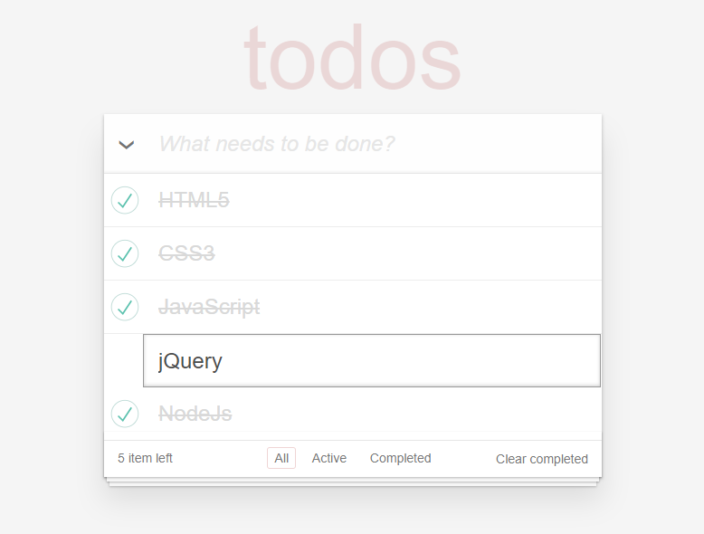

# TodoMVC App

> Template used for creating [TodoMVC](http://todomvc.com) apps

基于TodoMVC App Template 实现了两种前端框架的todos
[angularJs](https://xiong34664.github.io/todomvc/todomvc-app-angularjs)
[VueJs](https://xiong34664.github.io/todomvc/todomvc-app-vuejs)